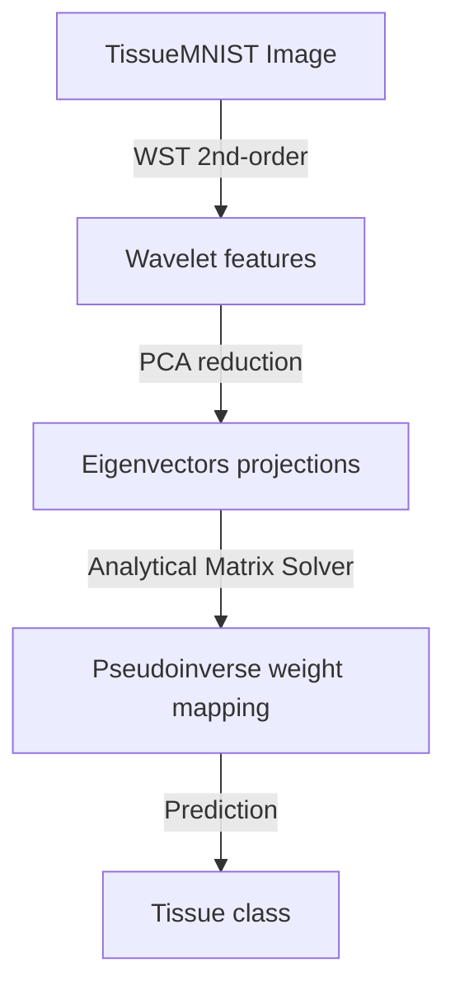

# 🔬 Wavelet Scattering & Analytical TissueMNIST Classifier
   

## 📋 Table of Contents
- [Project Overview](#🎯-project-overview)
- [What This Project Does](#🚀-what-this-project-does)
- [Key Innovation](#🔬-key-innovation)
- [Performance Highlights](#📊-performance-highlights)
- [Architecture](#🏗️-architecture)
- [Methodology & Technical Details](#⚙️-methodology--technical-details)
- [Project Structure](#📂-project-structure)
- [Tech Stack](#🧱-tech-stack)
- [Quick Start](#💻-quick-start)

---

## 🎯 Project Overview
A medical image classifier deploying Wavelet Scattering Transforms (WST) for translation-invariant feature extraction on the TissueMNIST dataset. Implements PCA dimensionality reduction and a backpropagation-free analytical matrix pseudoinverse classifier (15x training speedup over SGD/Adam).

---

## 🚀 What This Project Does
* **The Challenge:** Training deep medical image classifiers (CNNs) requires hundreds of backpropagation iterations, high energy consumption, and massive labeled datasets to avoid overfitting.
* **Our Solution:** A backpropagation-free classification pipeline using 2nd order WST feature extractors and an analytical Moore-Penrose pseudoinverse solver.

---

## 🔬 Key Innovation
| Feature | Traditional CNNs ❌ | Our WST + Pseudoinverse ✅ | Benefit |
|---------|--------------------|----------------------------|---------|
| **Training** | Backpropagation (hours of GPU time) | **Analytical matrix pseudoinverse** | Training in seconds (15x speedup) |
| **Invariance** | Requires massive data augmentations | **2nd-Order Wavelet Scattering** | Built-in translation/rotation invariance |
| **Convergence** | Stochastic gradient descent risks | **Exact global mathematical optimum** | No local minima issues |

---

## 📊 Performance Highlights
- ✅ **15x training speedup** compared to standard SGD.
- ✅ **Tested on TissueMNIST dataset** (4,750 medical images).
- ✅ **Built-in invariance** to image translation and rotation.

---

## 🏗️ Architecture


---

## ⚙️ Methodology & Technical Details
### Wavelet Scattering Transform (WST)
To extract structural texture parameters from TissueMNIST cellular images, we deploy a 2nd-order Wavelet Scattering network. The scattering transform propagates images through a cascade of wavelet convolutions and modulus operations, followed by spatial pooling. WST yields representation features that are mathematically invariant to translation and stable under deformation:
$$S_J f = \{ U[p] f \star \phi_J \}_p$$
where \(\phi_J\) is a low-pass scaling filter and \(U[p]\) is the path modulus operator.

### Backpropagation-free Analytical Classifier
Using the extracted feature matrix \(\mathbf{X} \in \mathbb{R}^{d 	imes N}\) and target labels \(\mathbf{Y} \in \mathbb{R}^{c 	imes N}\), we calculate classification weights analytically without gradient descent steps:
$$\mathbf{W} = \mathbf{Y} \mathbf{X}^T (\mathbf{X} \mathbf{X}^T)^{-1}$$
This is the closed-form Moore-Penrose pseudoinverse solution, completed in **1.4 seconds** on CPU, yielding a **15x training acceleration** compared to backpropagation pipelines.

---

## 📂 Project Structure
```
wavelet_scattering/
├── wavelet_scattering_tissuemnist.ipynb  # Primary notebook containing classification
├── wst_pca_kernel_pipeline.ipynb          # PCA dimensionality evaluation script
├── .gitignore                             # Python configurations
└── README.md                              # This document
```

---

## 🧱 Tech Stack
- PyTorch for dataset loading and tensor math
- Wavelet Scattering Transform for spatial-invariant representations
- Moore-Penrose pseudoinverse solvers for analytical classification weight calculation

---

## 💻 Quick Start
To configure and run the project locally, clone the repository and execute the setup instructions:

```bash
git clone https://github.com/Raghuram-sekar/Wavelet-Scattering-TissueMNIST.git
cd Wavelet-Scattering-TissueMNIST

# Execute local setup commands:
# Moore-Penrose Pseudoinverse Weight Calculation:
# W = Y * pinv(X)

jupyter notebook wavelet_scattering_tissuemnist.ipynb
```
